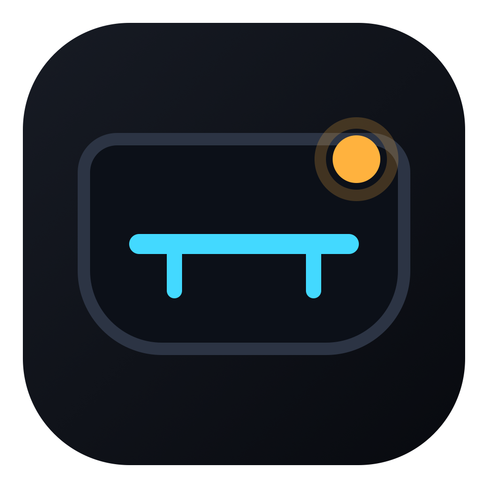
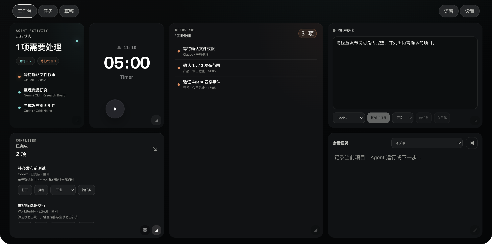
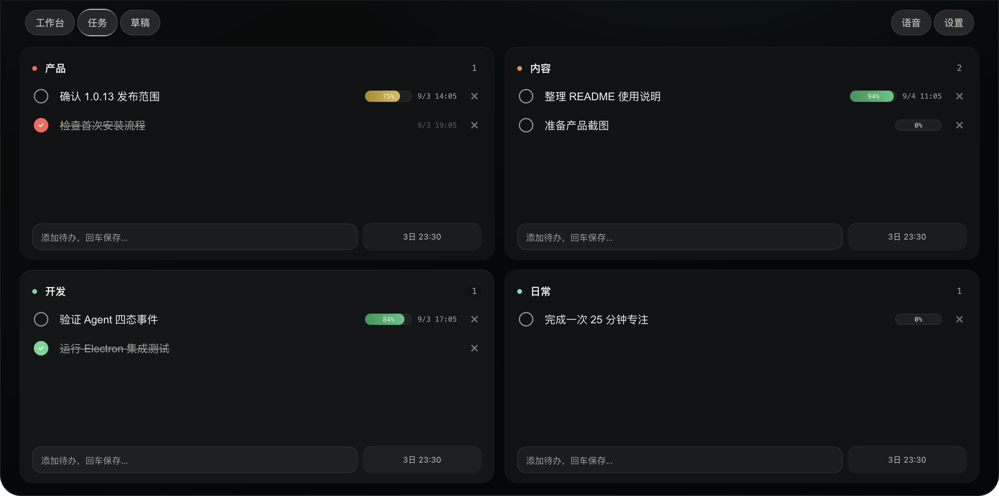
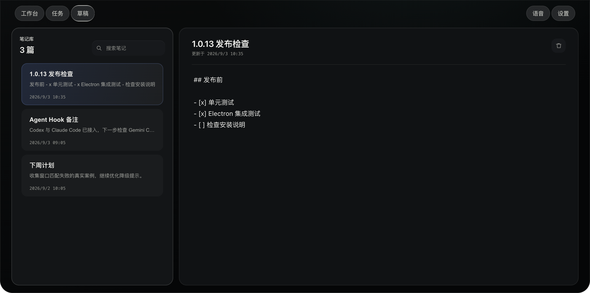
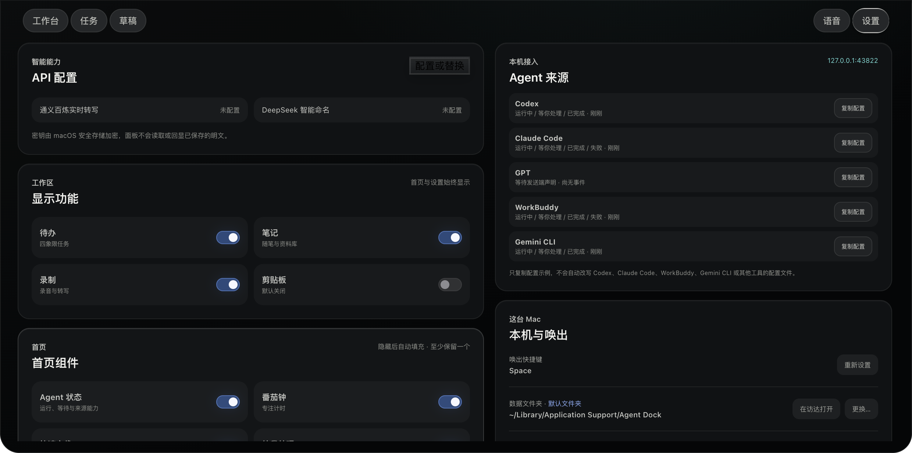

<div align="center">
  
  <h1>Agent Dock</h1>
  <p><strong>把 Mac 刘海变成本机 AI Agent 状态台。</strong></p>
  <p>在一个工作台里查看 Codex、Claude Code、WorkBuddy、Gemini CLI 与 GPT 正在做什么、等你处理什么、刚完成了什么。</p>
</div>

> 当前代码版本：**1.0.13** · macOS 13.0+ · Apple Silicon



## 它能做什么

- **运行状态**：统一查看各个本机 Agent 的运行、等待、完成与失败状态。
- **待我处理**：汇集需要确认、可能过期、最近失败和临近截止的事项。
- **已完成**：保留清洗后的成果摘要，支持打开对应应用、复制摘要或转为任务。
- **快速交代**：先整理一段要求，再复制并打开目标 AI；内容不会自动发送。
- **本地工作区**：内置任务、草稿、番茄钟、语音记录和可选剪贴板。
- **桌面伙伴**：48px PNG 小猫会沿面板边缘巡逻，并按专注与 Agent 状态切换动作。

<table>
  <tr>
    <td></td>
    <td></td>
  </tr>
  <tr>
    <td align="center">四象限任务</td>
    <td align="center">会话草稿</td>
  </tr>
</table>

## 安装

1. 在当前仓库的 **Releases** 页面下载 `Agent-Dock-<版本>-arm64.dmg`。
2. 打开 DMG，将 **Agent Dock** 拖入“应用程序”。
3. 首次启动若被 macOS 拦截，前往“系统设置 → 隐私与安全性”，点击“仍要打开”。
4. 点击屏幕顶部的刘海区域，或使用默认快捷键 `Space` 展开工作台。

当前安装包仅支持 Apple Silicon。应用使用 ad-hoc 签名，尚未进行 Apple 公证。

## 快速使用

1. 先启动 Agent Dock。
2. 打开“设置 → Agent 来源”，在需要的来源旁点击“复制配置”。
3. 将配置合并到对应工具的设置文件并重启该工具。
4. 新建一次 Agent 任务；事件会出现在“运行状态”，需要确认时进入“待我处理”，完成后进入“已完成”。

Agent Dock 不会自动修改 Agent 配置，也不会主动发送、重试或编排 AI 任务。详细步骤见[用户使用说明](docs/user-guide.md)与 [Agent Hook 安装说明](docs/agent-hook-installation.md)。



## 隐私与权限

- 事件服务只监听 `127.0.0.1:43822`，不对局域网或互联网开放。
- 不保存完整对话、代码、Prompt、工具参数或绝对工作目录。
- 麦克风只在用户进入“语音”页并主动录音时启用。
- Apple Events 只用于用户点击“打开”后匹配并聚焦本机窗口。
- API Key 由 macOS 安全存储管理，不写入工作区或仓库。

本地数据默认位于 `~/Library/Application Support/Agent Dock`。应用可与原 TO-DO Panel 同时运行，二者使用不同的 bundle ID、数据目录和事件端口。

## 从源码运行

需要 Node.js 22.12.0+：

```bash
npm ci
npm test
npm start
```

生成 Apple Silicon DMG：

```bash
npm run build
```

项目是无需前端构建步骤的单进程 Electron 应用。运行时依赖只有 `ws`。

## Agent 事件接口

```text
POST http://127.0.0.1:43822/events/{source}
source = codex | claude | gpt | workbuddy | gemini
```

```json
{
  "version": 1,
  "event": "running",
  "run_id": "source-stable-run-id",
  "project": "Orbit Notes",
  "title": "整理发布说明",
  "summary": "不超过 280 字的摘要",
  "occurred_at": 1788192000000
}
```

`event` 只允许 `running | waiting | completed | failed`。非终态必须提供稳定 `run_id`；同一 `source + run_id` 会被归并为一次运行。

## 发布

推送与 `package.json` 版本一致的 `v*` 标签后，GitHub Actions 会运行测试、构建并校验 DMG、生成 SHA-256，随后创建 Release。完整流程见[发布说明](docs/releasing.md)。

## License

[MIT](LICENSE) © 2026 Agent Dock contributors
